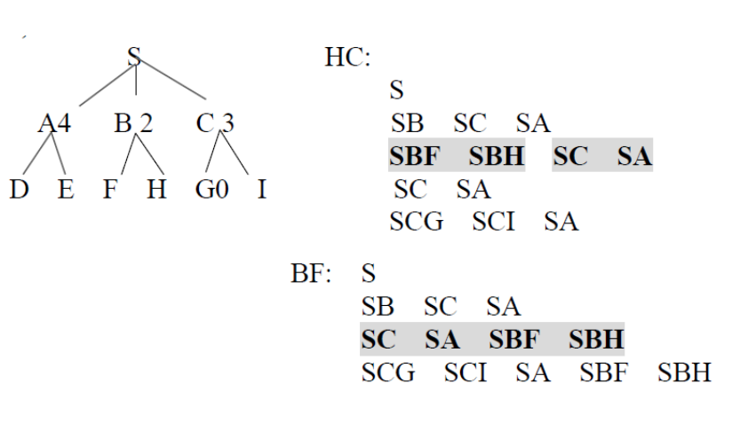
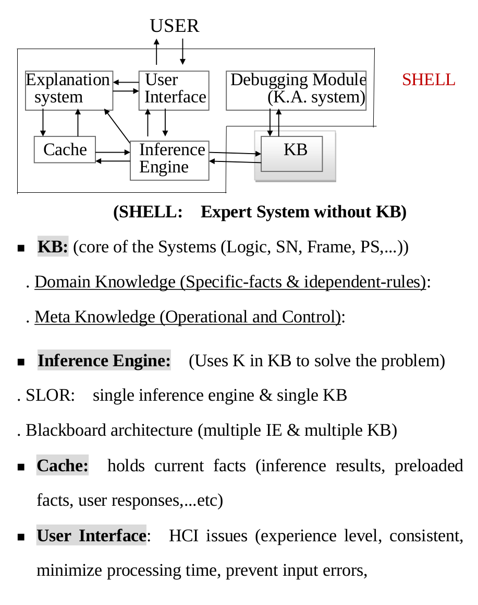
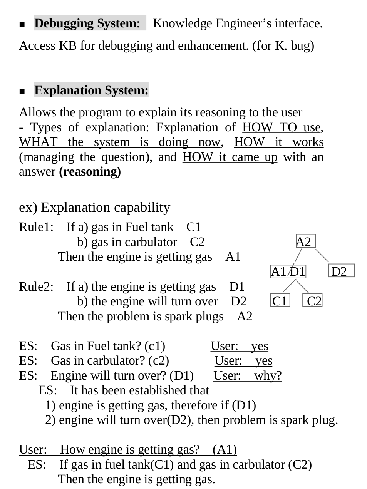
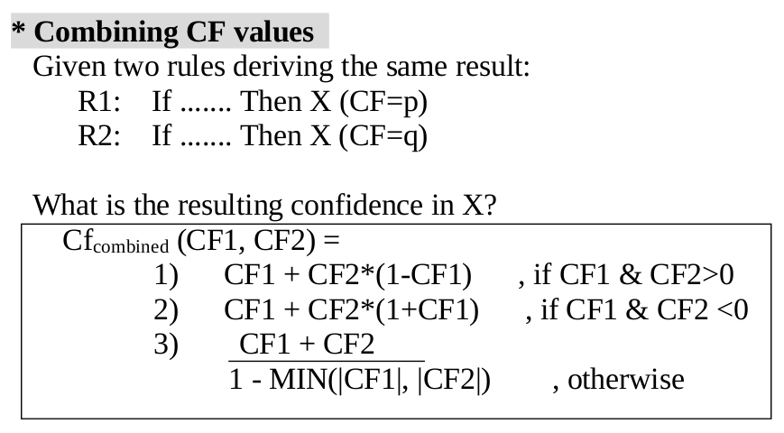

> 24.04.2017

### 셤공부 시작

* 튜링테스트부터 시작

* 컴퓨터가 사람처럼 될려면 뭐뭐 필요하냐

* NLP , 데이터를 가지고있어야함, 기반으로 새로운 데이터를 뽑아낼 수 있어야함 , 데이터로부터 패턴을 찾아낼 수 있어야함 ( 머신러닝 ), Vision, and others

* AI 란 ? 사람의 지적행동을 컴퓨터가 모방할 수 있도록 하는 과학/공학 분야

* 어떻게 AI 에 접근할 것인가 ( Knowledge-based랑 data-driven-Approach) 가 있음

* 이거 뒤엔 걍 AI 의 과거 현재 미래 얘기

### Search 란

* 문제 찾는 방법

### State Space representation

* State space -> graph ( V, E  )

* V는 노드셋 , E 는 노드끼리의 방향

* Heuristic search

* 특별한 정보를 가지고 서칭하는가 ( blind search 랑 다름 )

* Blocks world -> On-top(A,Table) 이면 A가 Table 위에 있는것

* 8 puzzle 은 그거고

## Basic search

* Blind search : Depth First Search ( DFS ) , Breadth first Search ( BFS )

* Heuristically Informed search : Hill-climbing, Best First, Beam search

## Optimal Search

* Branch and Bound, A샵

## Adversary Search

* Minimax

* Alpha-beta pruning

## 노드에는 세가지 상태가있다.

* OPEN 만들어졌으나 expanded 안된상태

* CLOSED expanded 된 상태

## BFS ( Breadth First Search ) - FIFO

* 인접한거 넣고 제일 최근꺼 빼고

## DFS ( Depth First Search ) - LIFO

* 계속 들어가다가 인접한게 없다 하면 롤백 하면서 다 찾기

* DFS 8 puzzle 다시보기

## Heuristically Informed Methods

* Hill Climbing Search

* 걍 DFS + edge 가 value 있는거임

* 8puzzle 도 비슷함

## Best first search

* 첫 베스트 노드를 맨뒤로 보냄

## Branch and Bound ( BB )

* BFS 가 더 나음

## Astar algorithm

* f(n) = g(n) + h(n)

* g(n) 은 start 에서 현재 노드까지 거리

* h(n) 은 노드에서 골까지의 거리

* f(n)은 스타트에서 골까지의 추산거리라고 볼수 있음

* 골까지의 f()을 이용해서 찾아감 BFS 랑 비슷

* [참고](https://www.slideshare.net/MoonLightMS/1113-a-star)

## Adversary Search - Game search

* Mini-max algorithm

* 뭔소린지 모르겠음

* [참고](http://www.aistudy.com/heuristic/adversarial_search_nilsson.htm)

### KR ( Knowledge Representation ) Reasoning 

* 걍 데이터의 의미에 대해서 어떻게 표현해야 될껀지 보여줌

* 데이터를 기반으로 새로운 데이터를 뽑아낼 수 있어야한다.

## Deduction

* 만약 알렉스가 수영했고 , 모든 수영한 사람은 젖는다 -> 알렉스는 젖는다.

## Induction 

* 많은 비슷한 것들로부터 결과 도출 -> 나는데 얘도 새고 얘도 새고 얘도 새고 그러면 모든 새는 난다.

## Abduction

* 알렉스가 젖어있고 , 수영을하면 젖는다. 그래서 알렉스가 젖었니? 는 아닐수도있음

## Propositional Logic

* 심볼 표현법

* and 나 or 나 not 같은 것들 pdf 확인해보기

## Predicate Logic

* 걍 데이터를 심볼표현법을 사용해서 표현하는법 이것도 pdf 봐보기

* some 을 조심해야함 can 일경우에 E , ^ 둘다사용 아닐경우에 ^만 사용

## Resolution

* 위에거 가지고 계산해서 결과 도출하는거 걍 한번 보면됨

* Resolution 이랑 non-resolution 에 대한 장단점이 나와있음 pdf 확인

* resolution 으로 검증하기 ( 한번 해보기 )

## Production system

* WM( Working memory ) , PM ( Production Memory ), Rule Interpreter 가 있음

* PM -> If A 라면 B다

* WM -> PM 을 이용해서 뽑아냄

* Interpreter ( Interface Engine ) -> PM 과 WM 을 이용하는 인터페이스

* forward 와 backward 방법이 있음

## SEMENTIC Network

* 데이터를 노드랑 링크로 표현하는 법

## Frames

* 비슷한 데이터끼리 묶는거

### AI language

* 걍 예제보기

* SWI Prolog , CLIPS , LISP 있음

### Problem Solving

* 에는 여러가지 방법이 있는데 앞에것도 그렇고

* 이번에는

* problem-reduction , And / or tree , means-end analysis (GPS) , AI Plannig 에 대해서 알아볼꺼임

## Problem-reduction

* 큰문제를 작은문제의 단위로 나누어서 푸는방법 ( large-memory 가 필요하고 시간이 오래걸림 )

## AND-OR graph

* 문제를 AND 랑 OR 게이트로 풀어냄

## General Problem Solver (GPS)

* Means-end analysis 를 이용해서 주로 풀어냄

* pdf 보기

## AI Planning

* 첫상태 , 원하는 결과, 액션 을 이용해서 진행

* plan 이란 -> 시작부터 goal state 까지 sequential한 steps나 actions 를 의미함

* Planning system ( planner ) 에 initial state , goal state , operator /actions 를 넣으면 plan 이 나오고 이걸 execute 시키면 만족시키는 goal 이 나옴

## Approaches to Planning 

* 클래식한건 nonhierarchical , hierarchical 그리고 Recent 는 opportunistic , Incremental , Re-planning , Dynamic Planning ...

* hierarchical planning 이란 전체적인 skeleton plan 을 짜고 각 sub goal 을 만족시켜가면서 최종 goal 로 가는 것

* non hierarchical planning 이란 하나의 플랜을 가지고 하나의 골을 향해서 가는 것

* 여기부턴 걍 pdf 볼것

### Uncertainty Management & Expert System

* 전문가들이 데이터에 대한 정의를 해놓은 시스템

* Data structure + Algorithm = Program , Knowledge + inference = System

* system architecture 

* Overview of how to build expert system

* 볼드체만 쓰겠음 , analysis , knowledge model , KR and Architecture, Coding, TESTING

## Uncertainty 

* 세상의 데이터는 uncertainty 함

# CF ( Certainty Factor )

* Large data 의 부족과 reasoning 을 설명해야하는 필요성에서 개발됨

* CF(X) = MB(X) - MD(X)  -1.0 ~ +1.0 의 범위사이

* MB ( Measure of Belief ) 말그대로

* MD ( Measure of Disbelief ) 말그대로

* If P1(CF1) and P2(CF2); Then R(CFr) 일경우 CFr = MIN( CF1, CF2 ) * CFr

* If P1(CF1) or P2(CF2); Then R(CFr) 일경우 CFr = MAX( CF1, CF2 ) * CFr

* example 이따가 풀어보면 될듯

## Bayesian Learning

* uncertainty 한 문제에대해서 예측으로 해결

* pdf 보기
