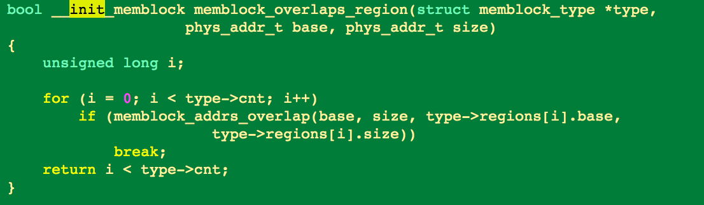

> 03.18.2017

###init/main.c 

main.c -> start_kernel -> linux/kernel/params.c : parse_args

line: 272

dts/~~ 에 chosen 노드를 파싱해서 args 로 사용함  

parse_args 에서 사용   

early_param 을 사용하면 struct 를 차례대로 돌면서 init 된 디바이스를 볼 수 있음  

early_mem ->  사용자가 mem 인잇해주면 그걸로 사용하고 원래 했던거 리셋함  
* 리눅스 소스에서 (at) 이  무슨뜻인지 확인해보기

http://jake.dothome.co.kr/ 공부하기
ARMv7-A의 페이징은 크게 Short-descriptor translation과 Long-descriptor translation 두 종류로 나뉩니다. Long-descriptor translation은 큰 물리 메모리를 지원하는 LPAE(Large Physical Address Extension) 기능

efi_init()

> 03.24.2017

* arm_memblock_init(mdesc) -> kernel text 랑 kernel data 랑 initrd 를 메모리에 init 하는 함수

* memblock_is_region_memory -> 메모리 블록에 arg로 들어오는 base + size 가 mem block 안에 존재하는지 확인하는 함수

* memblock_is_region_reserved -> base+size 가 예약된 영역에 침범하는지 확인하는 함수

* memblock_add_range -> 새로운 memblock region 을 예약하는 함수

> 03.25.2017

* sanity 체크는 결국 high memory 초기화 current limit 초기화

* 메모리 어떻게 움직이는지 확인 

* arm 메모리 시스템에 대한 것들을 쫌 확인해봐야할 듯 

* phys memory 랑 virtual memory arm 에서 어떻게 되는지 확인해봐야함

* memblock struct 확인해보면 current_limit 이 phys address 임 확인해보자

* CONFIG_BLK_DEV_INITRD initial ram filesystem and ram disk ( initramfs , initrd ) support

* xip 일때는 text 영역이 필요가 없으니까 제외 "arch/arm/mm/init.c" 790L, 19661C

* fdt -> flattened device tree -> device tree 중에 하나이다.

* arch/arm/mm/init.c -> 맨처음에 declare 부분 보면 __init 이란게 있다. __init 에 들어가는 것은 booting 이후에 지우고 싶은 데이터들을 집어넣는 과정을 define 해논 것

* initrd , initramfs 의 차이점 -> initramfs : cpio로 만들어진 ramdisk , initrd 는 /dev/ram + ext2 or ext3 ohter filesystem 으로 만들어진 ramdisk 라 /dev/ram으로 접근해야함

* CONFIG_BLK_DEV_RAM -> ramdisk support

* return 이 매우 인상적임

* swapper_pg_dir -> 커널이 쓰는 pg 테이블 을 초창기에 init 해주는 변수

* trustzone 왜 register 하고 써야함? 모든데?

* reserved-memory 의 address-cells 랑 size-cells 는 단위를 얘기하는듯?

* ENOENT -> no such file or directory

* okay 거나 ok 이면 을 이렇게 표현함 멋있따...

* reserved memory 에 대한 것 한번 공부해와서 공유해보쟈

> 03.27.2017

* 리눅스는 virtual memory 를 4G를 사용함

* virtual memory 와 physical memory 사이의 변환 시기 및 단계에 대해서 더 잘 알아야할 듯

> 04.01.2017

* __rmem_check_for_overlap 이 함수에 대해서 보고있음

* reserved_mem 이라는 static 변수가 나오는데 이 array 는 기존 regular 한 정보들 외에 dtb에 각각 들어있는 specified 한 memory 를 reserve 함

* heap sort 가 커널에서는 quick sort 보다 낫다 왜냐하면 최악의경우 quicksort 는 최악의 경우 n^2 이고 externel memory 를 요구하기때문에 항상 nlogn 을 가지는 heapsort 가 커널에는 적합하다.

* 오늘은 아빠 생일이라 집에감

> 15.04.2017

* 올만에옴ㅎㅎ

* dma 때문에 cma 관련 소스 보는중

* _pa -> virtual address to physical address

* bit 연산에 대해서 공부해야될듯

* cypher 에서 dma 를 쓰기도함 virtual 메모리나 cma region 이용해서 속도를 늘리기도함

* 커널 누수 탐지기가 있는것 같음

* kernel garbage collection 찾아보기

* order_per_bit: Order of pages represented by one bit on bitmap.

* arm 은 pgd -> pmd -> pte 의 세단계 페이지테이블을 관리함

* cr -> control register

* 느낌표 두개 -> smp_on_up 이unsigned int 니까 느낌표를 하나 붙이면 true 가 하나로 표시가 안댐 그래서 두개붙임

* cache default 설정이 있고 이걸 바꿔주는게 추가적으로 더있음

* xscale -> armv5 기반으로 만들어진 intel 꺼

* LPAE( Large Page Address Extension ) 

* 오늘 한것 : reserved 메모리 영역 확인후 init 하고 ( cma 영역도 확인 )  -> page table bit 들 확인하는법 ( arm_reference ) ->  page table init 하다가 끝남

> 29.04.2017

* SWAP memory 를 arm 에서 기본제공하는 것만으로는 다 커버칠 수 없으니까 linux 만의 pg table attribute 를 적용시킴

* shared bit 설정을 해주고 나중에 inner cache outer cache line 설정으로 어떤 레벨까지 share 할 수 있을지 결정함

* PXN bit excuting 못하게 설정해주는 bit

* 하드웨어 pt 과 linux pt 에 들어갈 properties 정리

* prepare_page_table -> pmd 랑 lowmem 초기화

* git blame 이라는 명령어가 있음 파일에 대한 변화 과정을 살펴볼 수 있는 것

* TTBRC 라는 레지스터가 있음 -> 이 레지스터를 통해서 하드웨어랑 linux 의 페이지 테이블 접근 방법이 달라짐

* pfn ( page frame number )

