### Challenges and Opportunities in Many-Core Computing

매니 코어 시스템에서의 전통적인 문제점들을 보여주는 논문

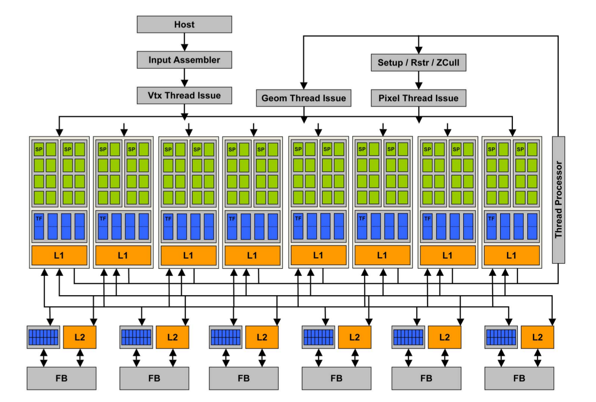

* 클럭 디지털 디바이스의 전력은 클럭 frequency에 비례한다. 

* 클럭 속도엔 자연스런 한계가 있다.

* 클럭 자체의 속도를 높이기위해선 파이프가 얇아져야만 하고 이를 위한 cooling 시스템 없이는 불가능하다.
  더군다나 클럭속도에 비해 메모리 성능 향상또한 프로세서 성능 향상에 비해 뒤떨어져있음. ( Power Wall )

* 메모리 시스템의 진화속도가 프로세서에 따라오지 못해 고전적으로는 캐쉬 크기를 증가시키는 것으로만 해결하려고 했음. ( memory Wall )

* 하드웨어 엔지니어들은 주파수 스케일링으로 인한 성능 향상 외에도 execution을 예상하는 시스템을 만듬으로써 성능을 향상 시켰음.

* 하드웨어적 안전 장치가 존재함으로써 순서가 잘못된 실행으로 부터 오는 오류를 예방하려고 했음.

* branch를 추측해서 동시에 실행할 명령어를 결정해야함. 이것을 instruction-level parallelism (ILP) 라고함

* 데이터 종속성으로 인해 분기가 없음에도 연속 명령어가 병렬로 실행되지 않을 수 있음. ( ILP Wall )

* Berkeley 의 Patterson 이 이론적인 serial performance 문제를 제기했음

***

 The power wall + The memory wall + The ILP wall -> a brick wall for serial performance

 위의 그림처럼 아키텍쳐마다 문제가 일어나는게 달라지기 때문에 각각을 정의할 수 는 없지만, 크게 봤을때 위 세가지를 합쳐 문제점이라고 볼 수 있다.

***

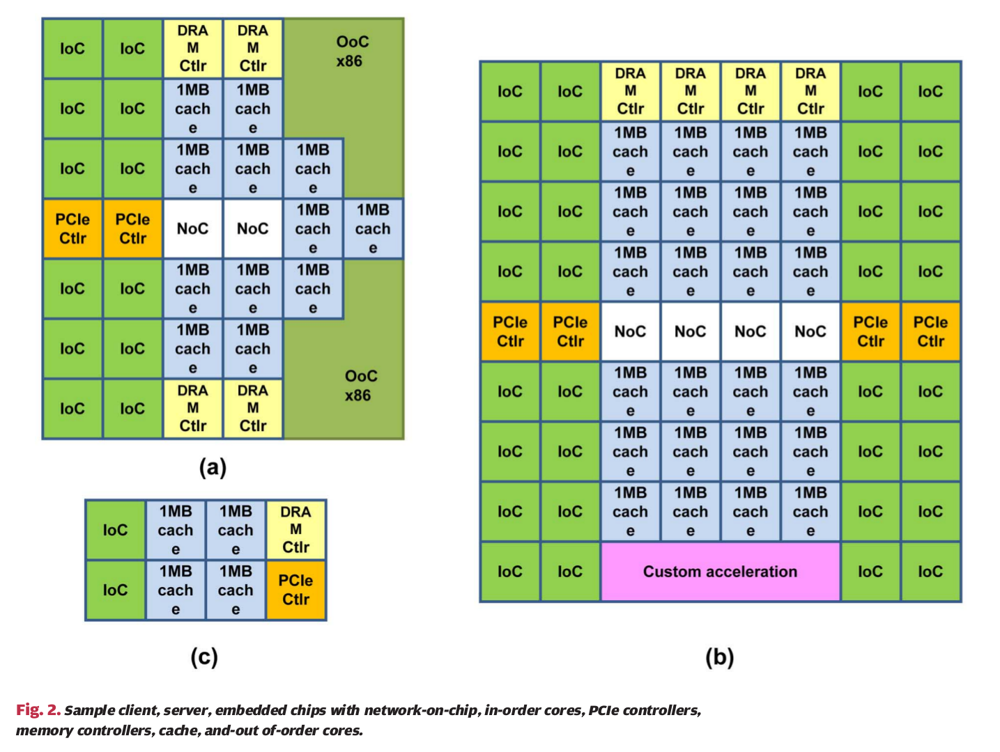

* fig.2(a) 를 봤을때 왜 큰 OoC 대신에 IoC 여러개를 쓰냐면 OoC는 일반적으로 ILP 의 limit에 걸려서 바보같은 성능을 보여줌. 그렇기 때문에 IoC 여러개를 사용하는 시스템을 선호. 임베디드 칩은 C 처럼 바뀌면 좋을것이다.(확인해보장)

* 여기까지 하드웨어 얘기

***

* 소프트웨어적 관점에서 몇가지 흥미로운 approach 들을 제시함

* 재사용 가능한 components 들로 도메인별 knowledge를 캡슐화 하는것

* concurrency 와 coordination을 위해 전통적인 언어들 ( C, fortran ... ) 로 쉽게 사용할 수 있도록 포팅하는 것

* 의미적인 수준을 올리면 명시적 sequencing이 제거된다? 가 무슨소리인지 잘 모르겠음

* 아.. 함수형 프로그래밍이 매니코어에 어울린다는 얘기인가?

* OS 쪽 얘기로 넘어감

* 현재 대부분의 OS는 uniform device model 을 씀 그렇기 때문에 security problem 과 optimize 시에 어려움이 있음.

* TSOS ( Time Sharing Operating System ) 에 대한 얘기가 나옴, 이게 70년대에 VMOS ( Virtual Memory Operating System) 으로 진화했다고함.

* TSOS 의 security 는 single authority 아래에 있음, 오늘날의 컴퓨터 트랜드에 맞지않음.

 

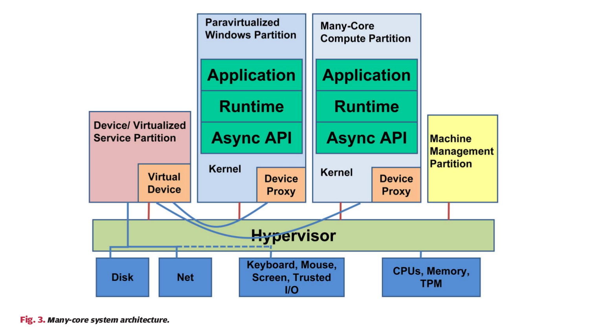

* OS와 hypervisor 상에서도 매니코어 시스템 지원을 잘 해야지 퍼포먼스를 올릴 수 있다는 요약인듯

Programmable systems are playing an increasingly large
part in our lives and, in many ways, provide a worldwide
paradigm shift comparable in scope and benefit to the
appearance of cheap, mass market printing. Many-core
computers signal a shift in computer science, computa-
tional science, and classical commercial software that
marry the past advances of many knowledge workers as
well as provide avenues for qualitatively new advances.

* 결론 : 매니코어 짱이라 삶이 윤택해질듯 근데 이런 어려운 문제들이 존재하니까 후대에서 풀어죠

### 매니코어 시스템을 위한 리눅스 가상 메모리 관리의 락 경합 분석

* 주현이형 2015 논문

* 결론 : 매니코어 시스템위에서 리눅스를 사용할 때 일어나는 메모리 관련 성능저하에 대한 벤치마킹 결과

### 매니코어 환경에서 로그 기반 동시적 업데이트 기법을 활용한 리눅스 커널 확장성 개선

* 2016 논문

* 높은 업데이트 비율로 인한 serialization 관련 문제에 대한 해결 방법은 non-blocking 알고리즘을 사용하는 방법과 로그기반을 사용하는 방법이 있다.

* 로그기반의 장점

1. 로그를 저장하는 순간에는 락이 필요없다.
2. 저장된 업데이트를 순차적으로 락과 함께 하나의 코어에서 수행해서 캐시 hit 비율이 올라간다.
3. 큰 수정 없이 기존 여러 데이터 구조에 쉽게 적용할 수 있다.
4. 저장된 로그를 실제 수행하지 않고 여러 가지 최적화 방법을 사용하여 적은 명령어로 업데이트를 수행할 수 있다.(?)

여기에 업데이트 순간 삭제 가능한 로그를 지움으로써 성능을 향상시키는 방법을 사용

* LTP ( Linux Test Project ) 통과함

* Anonymous reverse mapping , file reverse mapping 

> 03.21.2017, 03.28.2017

### Scalable Address Spaces Using RCU Balanced Trees

* working set 현재 프로세스 전용으로 할당된 물리적 메모리 페이지 그룹

* page fault -> hard fault + soft fault

* soft page fault -> working set 이 아닌 물리적 메모리상에 요청하는 페이지가 있기 때문에 메모리를 엑세스 하면 해결이 되는 fault

* hard page fault -> 요청하는 페이지가 메모리상에 없기 떄문에 디스크에 요청하는 것 

* concurrency -> 프로그램을 I/O를 수행하는 여러 개의 쓰레드로 구현하는 것을 의미함. 

* RCU (Read-Copy-Update) -> 읽기 동작에서 blocking 되지 않는 read/write 동기화 매커니즘

* write 가 10% 이상인 경우에는 다른 것을 선택하는 것이 좋음 [RCU-MC]( http://jake.dothome.co.kr/rcu/ )

* RCU 베이스의 binary-balanced tree for storing memory mappings 을 제시함

* 2.6.37 linux kernel 과 80코어 환경에서 실험해서 그 결과를 증거로 제시

* 이 논문은 x86-64 four-level page table 기준으로함, 그러나 아이디어는 x86 에 국한되지 않음

* mmap 이랑 munmap 의 시스템 콜을 memory mapping operation 이라고 부름

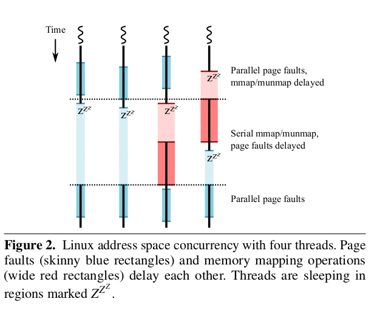

* 대부분의 시스템은 프로세스당 한개의 read/write 락을 사용하고 있음.

* 위 사진에서 하나의 프로세스에 한개의 락이 있을때 어떻게 page fault 가 진행되는지 과정을 볼 수 있음.

* bonsai tree 를 이용해서 해결했음

* RCU 를 모든 주소공간 스페이스에 적용하기에는 방법이 존재하지 않음.

* MOSBENCH, Dedup from Parsec 

* Serialization 이란 객체를 memory 에서 sequence of bits 로 바꾸는 것, serialization 된 후에 네트워크에서 이동하고, 프로그램간 정보로 교류가 되기도함. 다른 말로 marshalling 이라고 하기도 합니다.

* red-black tree -> 트리에 n 개의 원소가 있을 때 O(log n ) 으로 삽입, 삭제 , 검색이 가능 

* 윈도우 7 은 PFN lock 을 사용함

* bonsai 트리는  insert 와 delete에 대해서 read lock 을 없앤것

* single write lock 은 여전히 사용함

 
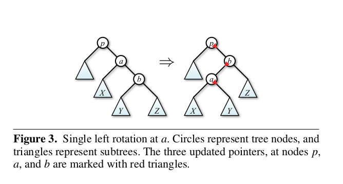

* single rotation 이 일어났을때 Z 를 못	보고 X,Y 까지 내려가는 경우가 생김, bonsai tree 는 이것을 해결함

* cache coherence -> 캐시 일관성 공유메모리를 가질때 각 프로세스별 일관성을 지켜야함

***

* A는 사기꾼 연금술사라 무슨 일이 있어도 금괴를 다른 사람이 구별할 수 없도록 만들어야 하고, B는 금괴 감정사라 가짜를 반드시 구별해야 하는 상황이다. 그런데, A와 B가 어느날 만나서 서로 금괴를 만들고 이를 구분해내는 것으로 내기를 하기로 했다. A는 최선을 다해 가짜 금괴를 만들어서 B에게 주면, B는 이걸 진짜와 구분한 뒤에 자신의 비법을 어딘가에 정리를 한다. A는 B의 비법을 어떤 방식으로든 (여기서 다양한 방법이 등장함, 이들의 지식이 연결고리를 가지기도 하고 각자 따로 경쟁하기도 하고) 반영해서 새로 금괴를 만들어서 다시 B에게 주면 B는 또 다시 열심히 연구해서 구별하는 방법을 정리한다. 이게 계속 반복되면 A는 정말 금괴를 잘 만들 수 있게 되고, B는 날이 갈수록 정교해지는 A의 금괴를 구별하기 위해 자신의 구분 실력이 더 늘어남을 알게 된다. 시간이 흘러 B가 자신의 금괴를 거의 구별하지 못하는 것을 알게 되자, A는 금괴를 만들어서 팔고 다니는데, 이것을 가짜라는 것을 알아차리는 사람들이 거의 없다. 여기서 A나 B나 같은 종류의 지식(=네트워크)를 가지고 구분을 하거나, 만들어내는데 이것이 GAN 네트워크의 특징이다.

저 비유 상황에서라면, GAN의 목적이 "최고의 연금술사 만들기"라는 점을 짚고 들어가시면 좋을 것 같습니다. 간단히 GAN의 과정을 다음과 같이 요약한다면 --- 진짜 금괴 몇개를 먼저 연금술사에게 보여주고, 비슷한거 만들어보라고 시켜놓고, 금괴감별사를 초빙해서 만들어낸것과 오리지날 금괴를 비교하게 해서 피드백을 연금술사에게 준다. 무한반복 --- 고된 훈련을 통해 연금술사는 점점 감별사가 구별하기 힘든 것을 양산하게 되겠지요. 결국 저 셋팅을 마련한 사람의 목적은, 초짜 연금술사가 마침내 처음 시작한 오리지날 금괴같은것(구별불가능한 것)을 양산하는 마스터 연금술사가 되길 기대한다는 점이라고 생각합니다

***

> 03.22.2017

### 이어서

* 만약 rock-free reader 가 업데이트 전에 tree 에 접근하려고 하면 old-tree 를 접근하게 된다.

* bounded-balance tree 에서 착안을 받아서 만들었으며 weight 를 파라미터로 사용하기 때문에, 이때문에 기존 strictly balance tree 보다 rotation 이 적어짐

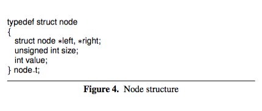

* C로 함수형 프로그래밍 하듯이 짯음

* 모든 트리의 노드는 위의 4가지 필드를 가짐

* insert 가 일어나면 insert 가 끝나기 전까진 reader 는 old 값들만을 읽게됨

* tree 를 reconstruct 할 때에 mkBalanced 라는 함수를 사용함

* balancing 이 끝난 트리는 지우지만, 만약 그 동안에 lookup 중이라면 모두 끝난 후에 invaild 시킴

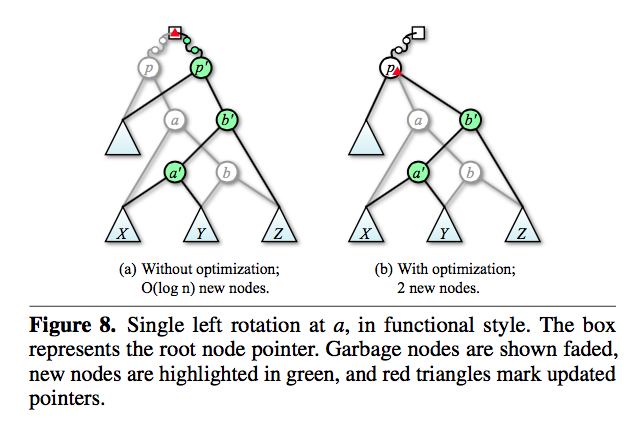

* 위의 (b) 를 봤을 때 mKbalanced 의 non-destructive rotate 를 볼 수 있음.

* VMA ( Virtual Memory Areas ) 란 workset 들이 존재하는 공간을 얘기하는듯? 확인필요함

* 리눅스는 process 단위로 read / write lock 을 적용함

> 03.23.2017

* mmap_sem -> read/write per process , protects address space

* Page dir. lock -> spinlock per process , protects Page dir, entries

* PTE lock -> spinlock per page table , protects Page table entries

* spinlock -> 진입이 불가능할 때 진입이 가능할 때 까지 루프를 돌면서 재시도하는 방식으로 구현된 락, 락을 획득할때까지 해당 스레드가 빙빙 돌고있다 (spinning)는 것을 의미함.

* 리눅스는 이중 잠금을 사용해서 락의 frequence 와 duration 을 줄이려고 했음.

* 그 예로 리눅스의 page fault handler 는 존재하지 않는 페이지 디렉토리 entries 를 관찰 한 후에만 페이지 디렉토리 lock 을 획득하고, 심지어 새 페이지 테이블에 대한 메모리를 많이 할당한 후에만 lock 을 획득함. 이 동시에 page fault 가 그 동안 페이지 디렉토리 entry를 채우면, 할당된 페이지 테이블을 단순히 버린다. -> double-check lock 때문

* 어떤 일이 있더라도 page fault 가 일어났을때 다른 thread 가 해당 주소에 접근이 불가능하기 때문에 매우 큰 문제임. heavy fault 일때는 더 심함.

* fault locking -> 메모리 write mode 에서 mmap sem 의 read / write lock 을 보유하는 시간을 줄여 soft page fault가 read-only part 와 동시에 실행 가능하게 하는 것

* hybrid locking/RCU -> hardware page table 구조와 각각의 VMA entries 에 RCU 를 적용해서 soft page fault 의 필요성을 없앴음.

* 이제 설명

* fault locking 을 위해서 fault lock 을 each memory space에 추가했고 page fault handler 가 read mode 에서 이 lock 을 acquire 하게 만들었음.

* write mode 일때는 똑같음 그러나 만약 write mode 일때 page fault handler 와 conflict 가 일어나게 된다면  fault lock 을 요구하게 된다.

* fault lock 은 mmap_sem 이 released 되었을 때만 released 된다.
 
* Hybrid locking/RCU 설명

* 얘네의 목적은 page fault handler 를 memory mapping operation과 다른 page fault 까지 모두 동시에 일어나도록 하는것임

* 얘네의 방법은 read lock 을 없앤것 (RCU 를 이용함)

* 제안하는 방법은 어떤 address space 에 관한 structural change를 가하지 않음.

> 03.27.2017

* VMA split race 설명

* page fault 는 segfault 일 수 있고, fault 주소를 포함하도록 확장되어야 하는 stack 영역에 있거나 VMA 분할 중간에 있을 수 있습니다.

* mmap_sem 이 저 problem 들을 control 할 수 있게 acquire 해놈

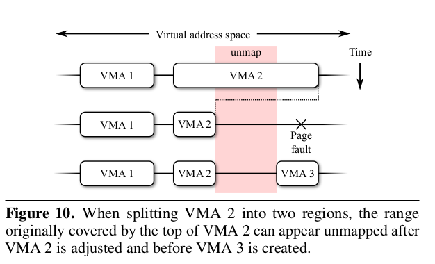

* 위 그림에서 보는 것 처럼 분할 중에 메모리 영역이 매핑되지 않은 상태로 일시적으로 나타날 수 있기 때문에 발생함

* munmap operation은 VMA를 2개의 VMA 로 나눌때 아래의 2스탭을 실행한다.

* 그림을 보면 어떤 문제인지 이해 가능

* Page table deallocation race 설명

* page directories 와 tables 은 vma 가 fault 났을때 mapping 을 새로하는 도중에 empty page directory entry 를 만났을 때만 새로 allocate 된다.

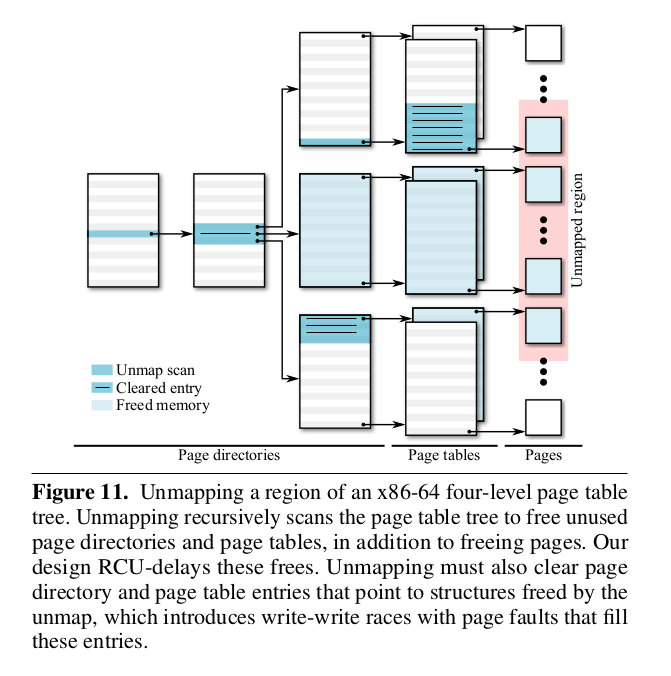

* 위 과정에서 2가지 문제가 있음

* 첫번쨰는 classic RCU : unmap 이 concurrent fault 때문에 사용중인 VMA, table , directories 를 비울 수 있는데, 이걸 해결하기 위해서 RCU delay 를 이용했음

* Page table fill race 

* stock linux 나 hybrid locking/RCU 에서는 fault 와 mapping free 사이의 경쟁을 해결하지 못한다.

* 만약 같은 VMA 에 대해서 page fault 와 munmap 이 같이 일어났다고 가정해보자.

* munmap 이 이미 faulting address 를 넘어갔을때 page table 은 faulting 난 address 를 free 하지 못하고 기다려야한다.

* 그리고 그 이후에 그 entry 자체를 clear 해버린다.

* 그렇게 되면 concurrent page fault 는 blank page directory 를 바라보고 있게되고 얘네는 새로운 page가 allocate 되야겠구나라고 생각한 후 완전 새로운 page를 가져오게 된다.

* 이건 간단하게 detect 할 수 있다.

* PTE lock 을 적용 하면 page table entry 가 채워지는걸 protect 하게 된다. 그러나 그걸 진짜로 채우기 전에는 page fault handler 는 doulbe-check 하게 된다 faulting 상태인지 아닌지

* Pure RCU

* 보통 OS는 virtual memory areas 를 tree에 보관함

* 그러나 일반적으로 사용하는 Red-black tree 나 AVL 은 RCU safe 하지 못하다.

* 이유는 만약 lock-less lookup 도중에 insert 와 delete가 같이 들어올경우 lookup failing 이 일어나게 된다.

* BONSAI tree는 이거를 해결함 

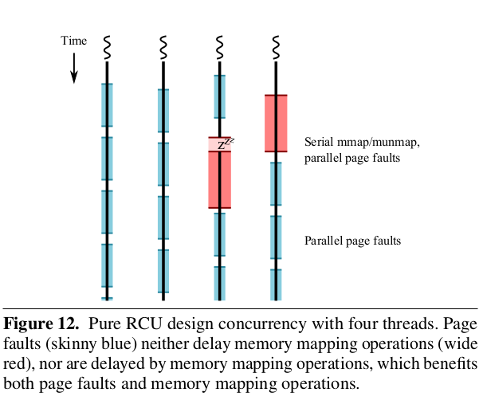

* 이제 뭘 구현했는지 알려줌

* current implementation 은 regular soft page fault in anonymous memory mapping 을 handle 함

* 5가지로 증명함

1. Can application scalability be limited by boottlenecks in the implementation of address spaces? 

2. Do the techniques proposed in this paper eliminate those bottle-necks?

3. Is a simple fine-grained locking approach sufficient to remove the bottlenecks or is RCU necessary?

4. Are short-duration read-locks acceptable in the soft page fault handler, or is the complete application of RCU necessary for scalability?

5. Are application workarounds still necessary to achieve peak scalability?

* 다시 읽어보장

> 03.28.2017

* false sharing -> align 이 strict 하게 적용되지 않은 구조체 들이 뭉쳐있을때 ex) 64비트 운영체제에서 65비트짜리 구조체가 캐싱되어있으면 이다음 자료구조와 겹쳐서 서로 방해가 일어 날 수 있음.

> 03.29.2017

### perf c2c 확인

* high level 에서 여러가지의 결과를 보여줌

* cachelines 에서 false sharing 이 어디서 detect 되었는지

* 캐시라인에 대한 reader, writer 정보와 이 access 들이 어디서 occurred 되었는지

* reader 와 writer 에 대한 pid ( process id ) , tid ( thread id ) , instruction addr , function name , binary object ( debug 플래그를 넣고 컴파일 해야되나? )

* source file 이랑 line number for each reader and writer

* cachelines 를 load 하는데 평균 load latency

* cacheline 이 생성된 샘플과 관련된 cpu가 어느 numa 노드에 있는지

***

* NUMA ( Non-Uniform Memory Access ) 란

* 메모리 설계 방법중의 하나, 각각의 프로세서에 독립적인 별도의 메모리를 제공하는 것, 매우 가깝게 연결된 컴퓨터 클러스터, 하나 이상의 프로세서가 동일 데이터를 필요로 하는 경우에 NUMA 시스템은 메모리 뱅크들 사이로 데이터를 이동시켜야 하는 경우가 발생하고, 이런 동작은 NUMA 의 성능을 떨어뜨리는 요인이다.

* SMP ( Symmetric Multiprocessing) 이란

* 두 개 이상의 프로세서가 한 개의 공유된 메모리를 사용하는 다중 프로세서 컴퓨터 아키텍쳐

* perf install 방법

* linux kernel 4.10 부터 지원가능

* ubuntu linux kernel update 

* (ubuntu kernel mainline)[http://kernel.ubuntu.com/~kernel-ppa/mainline]

"""

wget \

kernel.ubuntu.com/~kernel-ppa/mainline/v4.11-rc3/linux-headers-4.11.0-041100rc3_4.11.0-041100rc3.201703192331_all.deb \

kernel.ubuntu.com/~kernel-ppa/mainline/v4.11-rc3/linux-headers-4.11.0-041100rc3-generic_4.11.0-041100rc3.201703192331_amd64.deb \

kernel.ubuntu.com/~kernel-ppa/mainline/v4.11-rc3/linux-image-4.11.0-041100rc3-generic_4.11.0-041100rc3.201703192331_amd64.deb

sudo dpkg -i linux-headers-4.11*.deb linux-image-4.11*.deb

reboot

"""
ubuntu 14.04 -> 16.04 upgrade

sudo apt-get update
sudo apt-get upgrade
sudo apt-get dist-upgrade
sudo apt-get install update-manager-core
sudo do-release-upgrade

"""

> 03.30.2017

* 오늘은 매니코어 4차년도 워크샵 왔음

* [site link](http://manycoreos.synology.me/MediaWiki/index.php?title=2017-01_workshop#2017-01_Workshop)

* 서울대의 스파크 발표가 인상적이였음. configuration 을 자동으로 해주는 미들웨어를 만들었음

* 건국대 -> core affinity 관련된 연구진행중 올해안에 결과 내줄꺼임

* thunder_cp 뭐징 -> 하드웨어임 나중에 검색해보쟝

* sflinux, manycore patch 할꺼다

* 부산대 연구 : cloud haskell 을 위한 고차 함수 개발할꺼당

* 지금 파이프라인을 UX를 편하게 만들겠다.

* in memory 방식으로 바꿀생각 ( socket 기반에서 ) 

* template haskell 이모징 -> 이게 목표임 

* 슈어소프트에 무슨 공인인증을 받아야되는데 절차가 복잡함;

* azalea OS -> 매니코어 OS

* LWK , FWK 가 뭐지

* 8~9월에 공개할꺼임 라이센스는 GPL 이랑 MIT 섞어쓸꺼임

* 테스트배드 -> 400+코어 테스트베드 구축할꺼임 ( LWK *7 + FWK + IO offloading ) 

* 하이퍼스레드 안키고 할꺼임

* NVMe 설치해서 활용할 계획

* 2단계에는 1000코어 이상 예상중

* 이걸 위해서 이번 년차에 기존 LWK 최적화 부분 + LWK& FWK offloading 을 system call 기반으로 바꿀꺼임

* ssd 에서 읽어오는 걸 PCIe 이용해서 읽어오는걸 해볼려고함

* LWK 는 one core ver thread and one core ver memory 한 코어엔 한 스레드랑 한 메모리만 써서 서로 contention 이 일어나지 않음

* 자원이 효율적으로 활용되지 않음. 당연함 왜냐하면 스태틱이니까 

* 라이센스 문제에 대해서 잠시 얘기함 ( 듀얼라이센스 ? ) mit 랑 gplv2 -> 이건 사용하면 소스코드를 반드시 공개해야함₩

* tf 의 전신 distbelif , tf dev summit 2017 video 찾아보장

* tf variable , placeholder ... 소개함 session 실행 안시키면 결과 안나온다는 얘기를 계속 해주심

* 그래프 만들고 -> seseion 에 바인드해서 실행시켜주면 결과 데이터 나옴

* XLA ( Accelerated Linear Algebra ) experimental 한 stage [ref](https://www.tensorflow.org/performance/xla) -> for performance

* tensorflow 컴파일 과정 한번 살펴보자 -> 최종적으로 실행되는건 c++ 오브젝트이기 때문에 뭔가 python->c++ object or R or go 를 위한 compiler 가 특수하게 작성되어 있을듯?

* tf2xla -> tensor graph to xla graph -> tensor node 를 따라가면서 확인해서 xla object로 만들어서 graph 재생성

* JIT 얘기두함 pypy 같이?

* AOT ? ahead-of-time compilation -> 모바일 사이즈를 위해서 

> 04.03.2017

* 연구실 데스크탑이 죽어서 16.04 & kernel 4.10.8 으로 재설치함

### perf  설치

* 버전에 맞는 커널 소스 다운로드 나같은 경우에는 4.10.8

* perf make 할려면 flex 필요

* sudo apt-get install flex

* bison 도 필요

* sudo apt-get install bison

* make 로 들어가긴함

* build 완료

* 이전 perf 는 과감하게 sudo cp perf /usr/bin/. 로 지워버린다

### perf example

* https://github.com/joemario/perf-c2c-usage-files 클론

* sudo perf c2c record -F 60000 -a --all-user sleep 5 이런식으로 실행하고 ( parms 는 유동적으로)

* perf report 의 옵션을 활용해서 볼수있음

* ex)

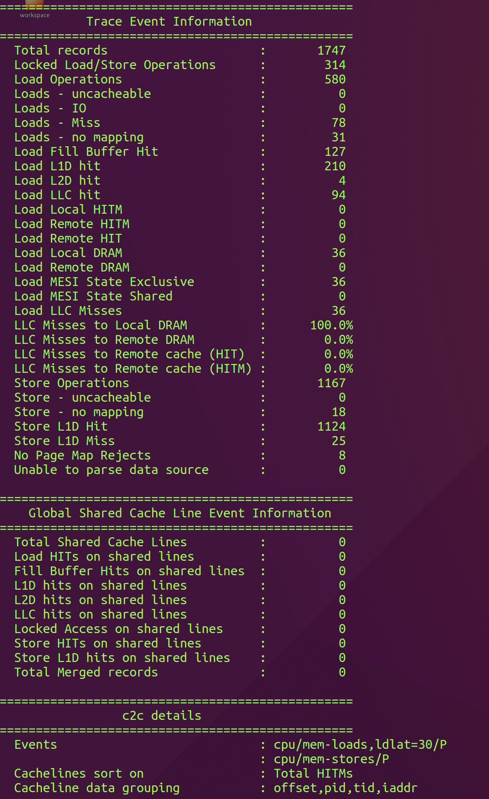

* 음... 사실 multithread 어플리케이션은 어떤 binary 가 오느냐에 따라서 성능이 크게 좌우되는것 아닐까?

* 멀티코어 cpu 와 매니코어 cpu는 엄연히 다른것

* 멀티코어는 하나의 cpu die에 여러개의 cpu를 집적해놓은 것

* KNL ( KNights Landing ) -> 코어가 최대 72개이며 x86프로세서로 동작하는 부트 호스트 프로세서를 내장, 따로 호스트 cpu가 필요없다. 자체부팅 가능

* Omni-Path Fabric -> 패키지 하나에 메모리까지 연결했음, 즉 온칩 메모리. 제온파이는 내장메모리 16gb를 이용해서 7.2gbps에 달하는 대역폭을 확보하고있음. MCDRAM을 썻다.

* 제온파이는 이런 구조 때문에 HPC영역에서 병목현상을 일으키던 메모리 문제를 해결했다.

* thread 를 loging 해서 재배열하는건 어때?

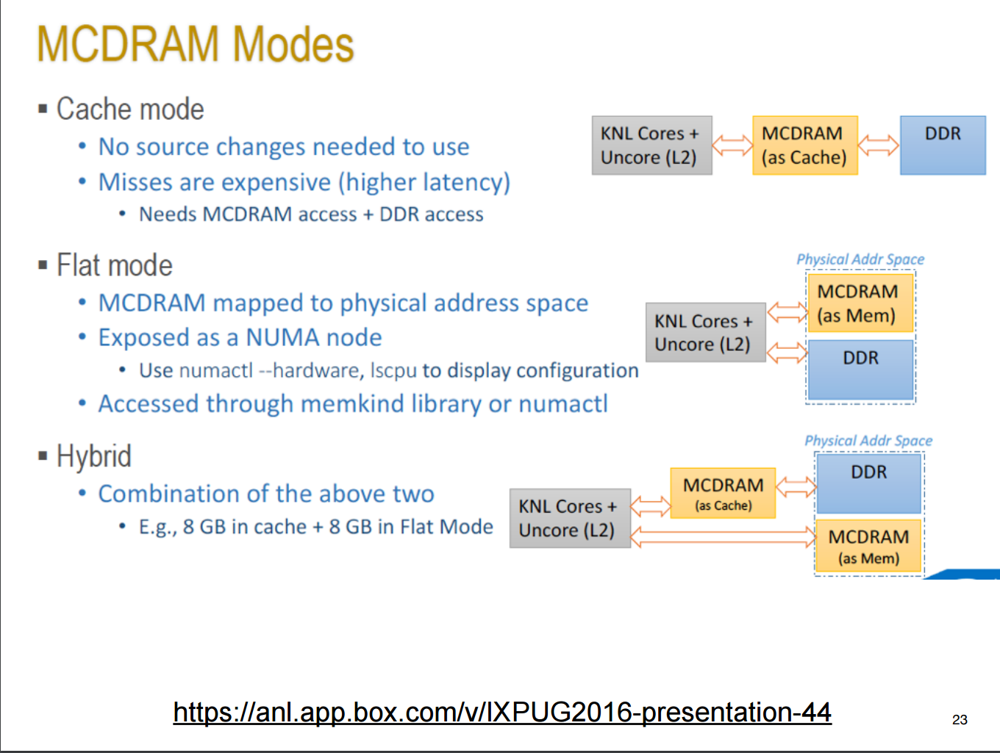

* KNL 은 MCDRAM 의 모드를 3가지 제공함

> 04.04.2017

* cluster mode 에는 3가지가 있음

* All-to-All -> 만약 L2 miss 가 일어나면 -> 모든 request를 distributed directory 에 보냄 -> directory miss 가 일어나면 memory 로 forwarding 함

* Quadrant -> 칩을 4개의 virtual space 로 나눔 -> address 를 quadrants 의 디렉토리로 해쉬함 -> directory 와 메모리의 유연함을 가질수있음 -> All-to-All 보다 low latency 를 가짐

* Sub-NUMA Clustering ( SNC ) -> NUMA 랑 똑같이 4개의 domain 으로 만들어서 OS 에서 그렇게 인식하도록함 -> 보기엔 4-socket  Xeon 으로 볼 수 있음 -> tile 과 directory 그리고 memory 사이의 유연성이 있음 -> local communication 이고 가장 적은 latency를 가지고 있지만, SW 가 NUMA에 optimize 시켜야함

* mcdram 은 총 4개의 메모리 모델을 가짐 ( 01.2017 기준 )

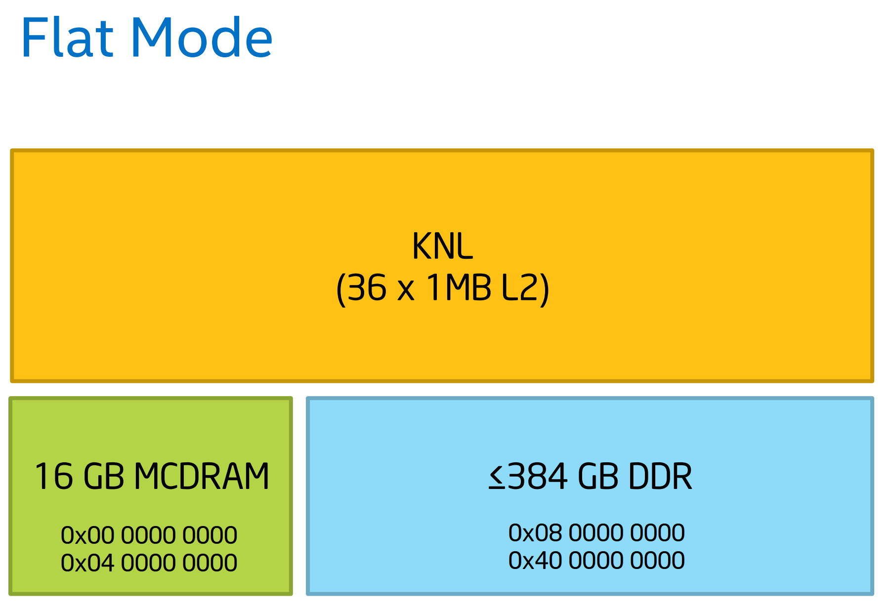

* 첫번쨰 Flat Mode -> 장점 : maximum bandwidth 와 latency performance 를 보장한다. 단점 : software 변경이 요구된다.(??), mcdram과 ddr hinders application flexibility 중에 선택해야 한다.

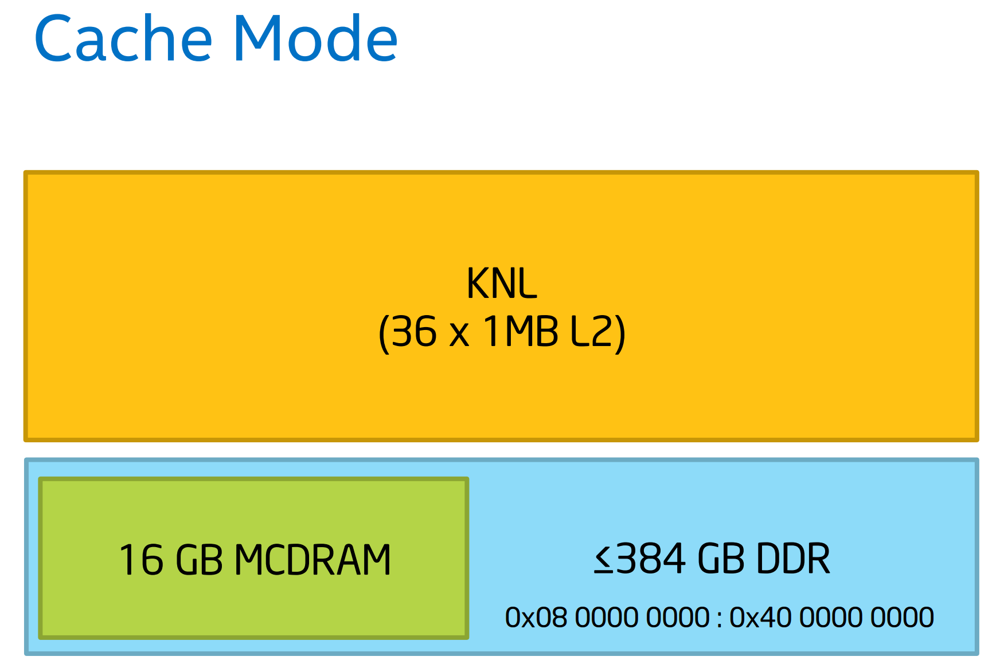

* 두번째 cache Mode -> 장점 : software change 가 필요하지 않다. bandwidth benefit 이 있다 ( ddr-only 에 연관되어있음 ). 단점 : latency hit 이 ddr 까지 떨어짐 , 제한된 bandwidth , 모든 메모리가 ddr -> mcdram -> L2 로 간다. , less addressable 한 메모리

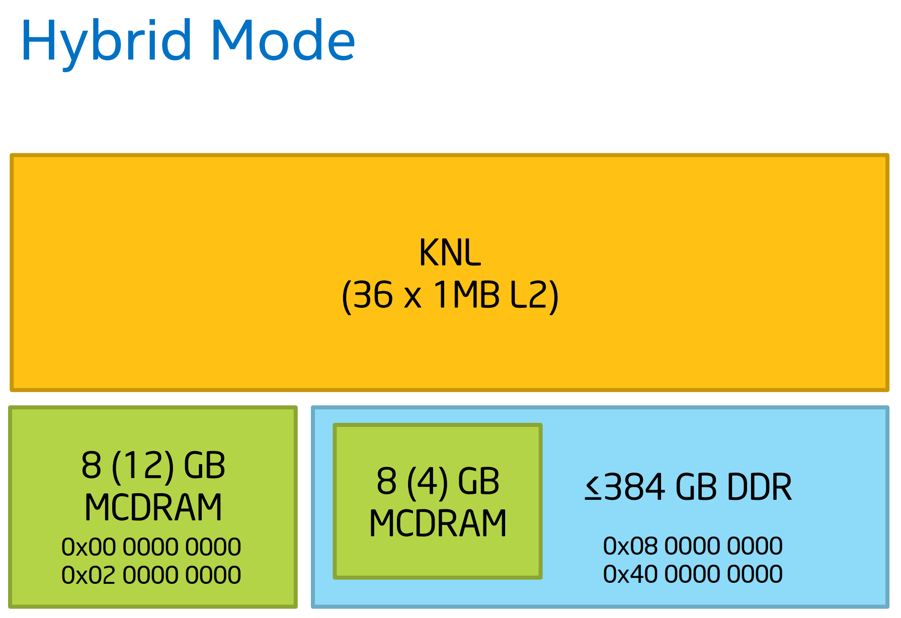

* 세번째 Hybrid Mode -> 장점과 단점은 얼마나 조합하느냐에 따라서 flat 과 cache 에 linear combination 하게 올라감

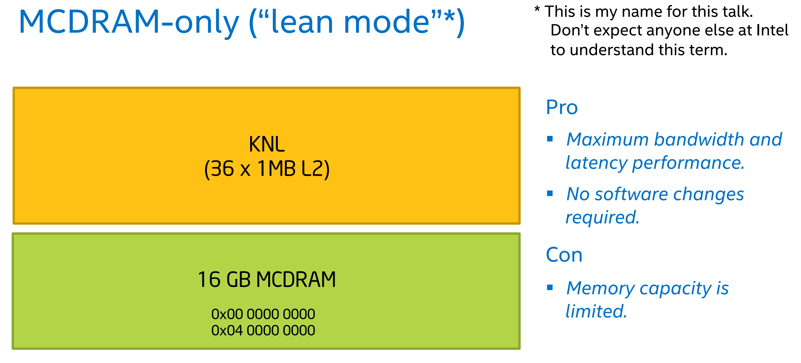

* 네번째 MCDRAM-only mode -> 장점 : Maximum bandwidth 랑 latency performance 를 가짐, 단점 : memory capacity 가 limited 됨

* 이제 이 두 메모리를 어떻게 manage 할까??

* 쉬운 방법은 메모리를 2개라고 생각하고 2가지 malloc 을 쓰는 것 ( maybe flat mode )

* advanced 한 모델은 memory menagement system 을 두는것

* advanced model 은 knl에만 국한되는 것이 아니당!!(강조)

* JEMALLOC + MEMKIND 은 long-standing software gap 을 해결했다.

### Heterogeneous Memory Management Framework

* MEMKIND -> FreeBSD 기반의 default heap manager 

* HBWMALLOC -> implements easy model ( 메모리를 2개라고 생각하고 2가지 malloc을 쓰는 것 ) for KNL , fallback behavior 을 select 할 수 있음 when package memory 가 존재하지 않거나 exhausted 되었을때.

* memkind_malloc or calloc or realloc 전부다 parameter 로 memkind_t 를 받음 -> 이게 mem 종류 즉 hybrid나 cached 이걸로 사용해야함

* KNL 에서 PARSEC 을 뭔가 변형해서 올해 acm 에 제출

* https://github.com/ParaGroup/p3arsec 나중에 확인해보기

* 아이디어1 -> 한코어는 전체 캐시를 동기화만 한다. 나머지는 busy 상태가 바뀌기만을 기다린다 -> fault 가 일어나는 순간 페이지들을 전부 교체

* 아이디어2 -> adaptive cache 를 이용하는 방법 -> behavior 예측이나 벡터화를 통한 예측 ( 딥러닝까지 응용 가능 )

* mode changing 에는 rebooting 이 필요함

* 결국에 한방에 모드 체인지는 불가능 -> 하지만 hybrid + x cluster 의 조합으로 충분히 유연한 policy를 가진 정책을 만들어볼 수 있을듯

### many core server configuration

### PARSEC 돌려보기

* Linux의 process 는 pid thread는 tgid ( thread group id ) 로 관리

> 05.04.2017

* HBM ( High-Bandwidth Memory ) -> MCDRAM 이당

* [ref](https://colfaxresearch.com/knl-mcdram/) -> MCDRAM 참조

* bandwidth-critical -> 애플리케이션에서 가장 중요한 부분을 ( 예를 들어 가장 퍼포먼스에 중요한 역활을 끼치는 -> 많이 엑세스 되는 ) 영역 을 얘기한다.

* 그렇다면 spm 에 맵핑하는 것 보다 훨씬 큰 부분들을 맵핑할 수 있기 때문에 좀더 다루기가 쉽지 않을까???

***

> 06.04.2017 

### Mostly-Optimistic Concurrency Control for Highly Contended Dynamic Workloads on a Thousand Cores

* DB에 관한 논문인데 concurrency control 이 겹쳐서 한번 읽어보기로함, 간단하게 볼 계획

* OCC ( Optimistic Concurrency Control ) -> 시스템에 적용되는 동시성 제어 방법, 여러 트랜잭션이 서로 간섭하지 않고 자주 완료 될 수 있다고 가정한다. 그래서 해당 자원에 대한 락을 획득하지 않고 데이터자체를 획득한다. 커밋하기 전에 각 트랜잭션은 다른 트랜잭션이 읽은 데이터를 수정하지 않았는지 확인한다. 확인 결과 충돌하는 수정사항이 발견되면 커밋 트랜잭션이 롤백되고 다시 시작 될 수 있다.

* 그래서 여기서는 MOCC ( Mostly-Optimistic Concurrency Control ) 을 제안함. 

* 여기 실험환경은 288 core 서버

* 기존 OCC는 low overhead를  many core server에서 보여줬음 단, low-conflict/contention worklaods에서

* OCC는 처리량을 크게 제한할 가능성이있다.

* MOCC 는 OCC를 기반으로 만들어짐.

***

* 각각 스레드는 진행하고 만약 concurrency lock이 걸렸을 경우에 진행하다가 끝나면 다시 돌아와서 실행.

* 상당히 많은 loop 가 필요할때 while 보단 for{;;} 가 효율이 더 좋다.

* testmysite.withgoogle.com -> 자신의 사이트가 모바일 친화적인지 확인하는 툴

* ARM 최신버전에서 syscall 을 call.S 가 아닌 syscall.tbl 로 관리함

* 확인해봐야 할것 -> 현재 리눅스에서 instruction 이 execution될 때까지의 처리(?) 과정

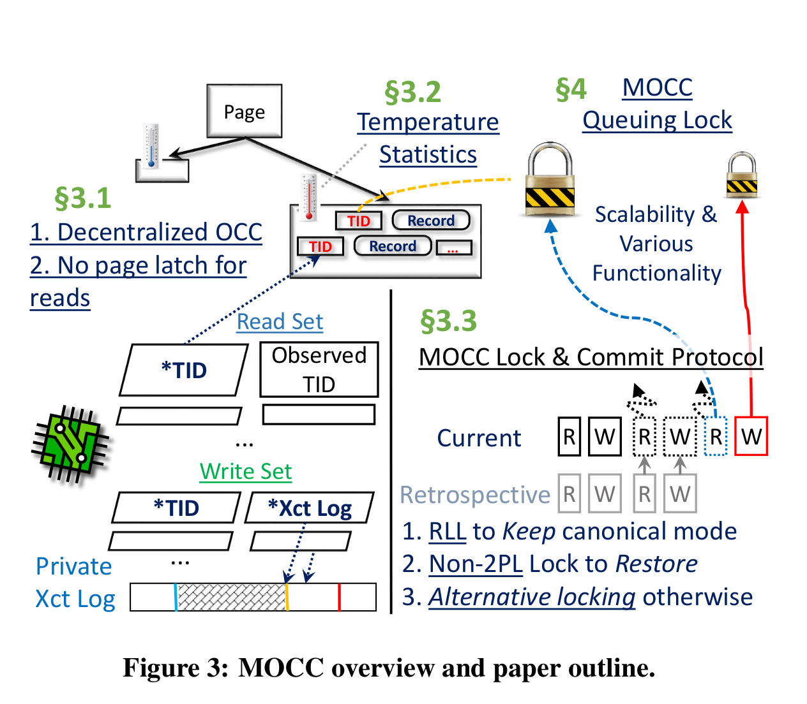

* MOCC의 overview임

> 06.04.2017 , 10.04.2017

### Is Parallel Programming Hard, And, If So, What Can You Do About It?

* Is Parallel Programming Hard, And, If So, What Can You Do About It? 라고 시작함

* shared-memory parallel machines 에서 programming 을 하기 위해서 읽으면 좋은 책

* 단순한 프로그래밍은 이제 개나소나 다할꺼다 그니까 parallel programming 해랑

* 이 책에서는 parallel programming 이 어려운걸 설명하는 것보다 왜 어려운지 설명하는 데에 초점을 맞출꺼다

* 전통적으로 아래 5가지의 문제점이 있어왔음

* 병렬시스템의 고비용과 희소성 ( The historic high cost an relative rarity of parallel systems ) 맞나..

* 전형적인 researchers와 practitioners의 parallel system에 대한 경험 부족

* 공개적으로 access 할 수 있는 병렬 코드의 부족성

* 병렬 프로그래밍에 대해 널리 이해하는 엔지니어링 분야의 부족

* shared memory 컴퓨터에서 처리속도에 비해 통신 오버헤드가 너무 큼

* 최근엔 이 문제들이 해결되 가고있음

* Parallel Programming 의 goals -> performance, productivity , generality

* 첫쨰로 performance

* ex ) scalability ( performance per CPU ) , efficiency ( performance per watt )

* 둘쨰로 productivity

* 하드웨어가 싸지고 있기때문에 더욱 중요해지고 있다.

* 마지막으로 generality

* c/c++의 locking plus threads 를 이용하는 방법

* JAVA 도 있는데 별루임

* MPI ( Message Passing Interface ) -> 위의 locking threads 를 이용하는 것보단 productivity 가 높다.

* OpenMP -> performance에 가끔 limit 이 걸리긴 하지만 MPI 나 C/C++로 프로그래밍 하는 것보다 훨씬 쉽다.

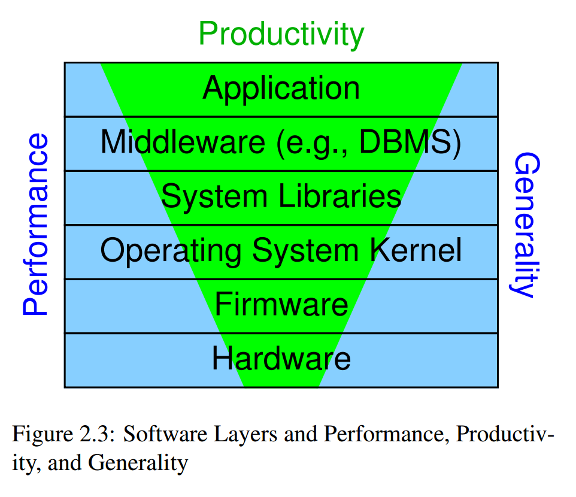

* productivity 와 performance generality 를 보여주는 사진

* SQL ( Structured Query Language ) -> 이건 database 에 주로 사용되지만 performance 는 꽤 좋다 TPC ( Transaction Processing Performance Council ) benchmark result 에서

* Productivity 는 완전 좋다.

* 어떤것들이 pararell 프로그래밍을 어렵게하나

* work partitioning -> 일을 나누기 어렵다 스레딩 or 멀티프로세싱하기 어렵다.

> 10.04.2017

* 어제 밤 오늘해서 과제끝냄 ㅠ 다음부턴 미리미리 해야지

* memkind api 살펴보는중임

* 엥 메모리 모드는 3개였는데 11가지 타입을 사용함

* MEMKIND_DEFAULT -> standard memory ( 아마 DDR을 얘기하는듯 ) + default page table size

* MEMKIND_HUGETLB -> standard memory + huge pages ( 시스템 config에서 huge table config 가 따로 필요하다고함 )

* MEMKIND_GBTLB -> standard memory + giga byte huge pages ( 이것도 똑같이 필요 )

* MEMKIND_INTERLEAVE -> 하드디스크에서 쓰는 방법인데 성능을 높이기위해(?) 섹터들을 나누어서 배열하는걸 인터리브드 라고함, 즉 거대한 페이지를 모든 NUMA 노드에 interleaved 해서 배열해 놓고 이걸 하나의 큰 페이지로 쓰는 방법인듯 -> 확인이 필요함

* MEMKIND_HBW -> HBW memory에 allocate 하는것 만약 모자라면 단순히 errno 을 뱉음 -> 근데 이게 가능한가? 페이지 fault 가 나야하는게 정상아닌가 가상화 시켜놓는건가

* MEMKIND_HBW_HUGETLB -> HBM + huge table 이하동문

* MEMKIND_HBW_PREFERRED -> HBW와 다르게 만약 allocate 실패하면 DDR 에 자동 allocate

* MEMKIND_HBW_PREFERRED_HUGETLB -> 위에것 + huge table

* MEMKIND_HBW_GBTLB -> MEMKIND_HBW와 같은데 GB table을 위한 것 ( 굿 use case -> reallocs 를 사용하는 거고 gb_realloc_example.c 를 보면 알 수 있다고함)

* MEMKIND_HBW_PREFERRED_GBTLB -> 위와 같음 그러나 allocate 실패하면 ddr에 자동 allocate

* MEMKIND_HBW_INTERLEAVE -> 위의 일반 interleave 와 같음 근데 이렇게하면 성능이 왜 높아지지 이따 수업갔다와서 고민해보자

* 그렇다면 MEMKIND_HBW_INTERLEAVE 모드로 되어있을때 메모리를 어떤식으로 나누는지 확인해봐야할듯

* 일단 memory 가 interleave 될때 어떤식으로 나눠지는지 확인해봐야해서 KNL에 memkind설치중

* memkind example 폴더에 merge request 날려볼려구함

* 메모리 인터리빙이란? 성능을 높이기 위해 데이터가 서로 인접하지 않도록 배열하는 방법

* example 만들어서 merge 요청 보냈음

> 10.05.2017

* 엥 travis 빌드 fail 남 이따가 확인해볼것

### Is Parallel Programming Hard, And, If So, What Can You Do About It?

* Chapter 3 Hardware and its Habits

* cpu는 하드웨어적 한계에 부딪힐 수 밖에 없다.

* ex) old and new cpu , meets a pipeline flush , memory reference , atomic operations

* memory barriers

* cache misses

* io comletion

* chapter 4 Tools of the Trade

* shell script, posix , gcc classic atomic operation , c11 atomic operation , per-thread variable ..

* Chapter 5 Counting

* Eventually consistent implementation

* per-thread-variable-based implementation

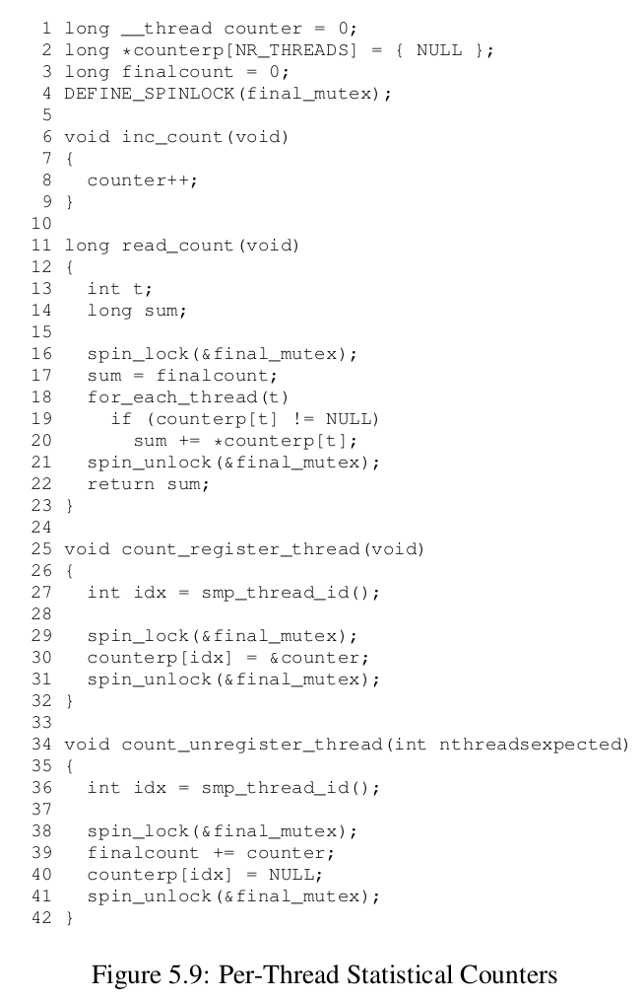

* 각각 계산해서 read 할때 락걸고 합침

* 여기까지 static counter 였고

* Approximate Limit Counter

* 어쨋든 스레드로 나눠서 진행하게 되면 무조건 동기화하는 시간이 필요함

> 11.04.2017

* memkind 에 example 커밋함 ㅎㅎㅎㅎ

### Is Parallel Programming Hard, And, If So, What Can You Do About It ?

* Chapter 6

* Partitioning and Synchronization Design

* Dining Philoshphers Problem 부터 얘기하고 있음

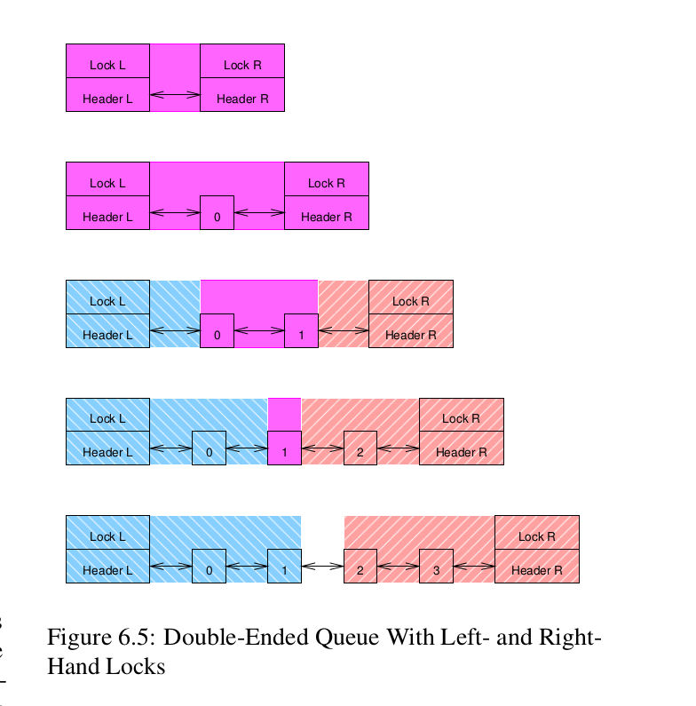

* Double-Ended Queue는 몇가지로 나눠짐

* Left-and Right-Hand Locks

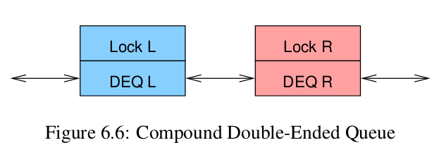

* Compound Double-Ended Queue

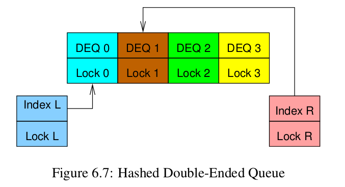

* Hashed Double-Ended Queue

* Partitioning Example Discussion

* Speedup , Contention , Work-to-Synchronization Ration , Read-to-Write Ratio , Complexity 를 고려해야함

* 예를 들어 10개의 cpu는 1개의 cpu를 10개 돌릴때의 시간의 1/10 보다 적게 소비해야 이득이다.

* cpu가 많다고 무조건 좋은게 아니당 -> 당연함

* primitives 가 가드하는데 오버헤드가 높다면 primitives를 줄이는게 가장 좋은 방법임

* 결국엔 read write lock

* Sequential Program

* code locking

* data locking

* data ownership

* Locking Granularity and Performance

* Parallel fastpath -> Reader/Writer Locking , RCU , Hierarchical Locking , Allocator Caches

* Reader / Writer Locking -> 주로 POSIX 써서함

> 13.04.2017

* coarse-grain , fine-grain -> 어떠한 프로세스를 잘게 쪼개느냐 아니면 굵게 쪼개서 뭉뚱그려 놓느냐 전자가 coarse , 후자가 fine

* Hierarchical Locking -> 계층락 -> 특정상황에서만 괜찮음

* Resource Allocator Caches

* Parallel Fastpath for Resource Allocation

* cpu는 각각의 cache 를 가지고 있고 large code-locked shared pool for additional block 을 가지고 있음.

* 한개의 cpu가 독점하는 것을 막기위해서 기본적으로 limit 한다.

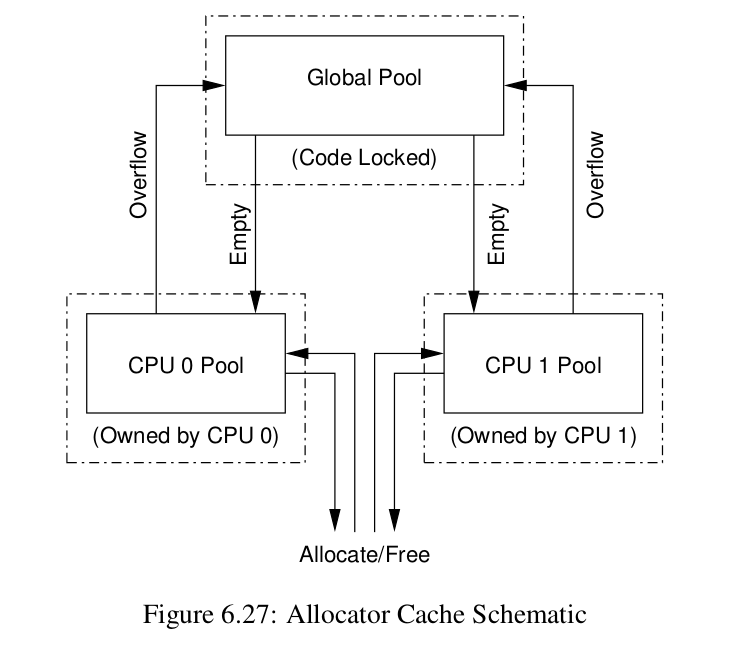

* Data Structures

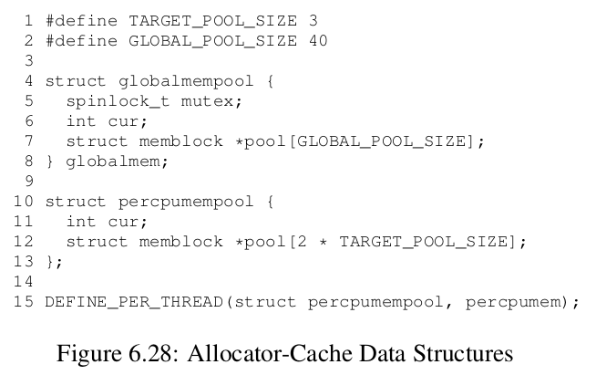

*  non-NULL pointers 갯수보다 cur 은 항상 1 작다.

* Allocation Function

* real world 에선 좀 다르다

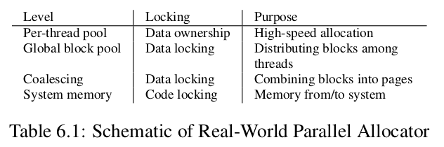

* PWQ ( Parellel Work Queue )

* Locking~~~~

* 기본적으로 많은 락들이 계층락, deadlock-detection , Locking-friendly data structure 를 쓰고있다.

* 일부 문제는 멍청하게 디자인된 프로그램에서만 일어난다.

* Deadlock

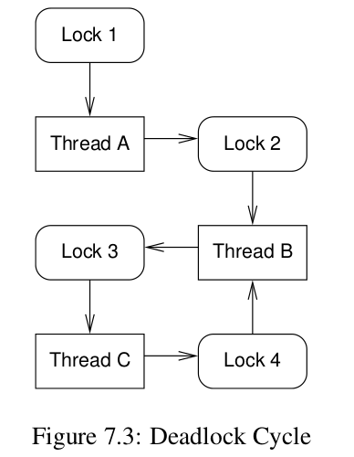

* deadlock senario

* 데드락을 recover 하는것보다는 안생기게 하는 것이 중요하다.

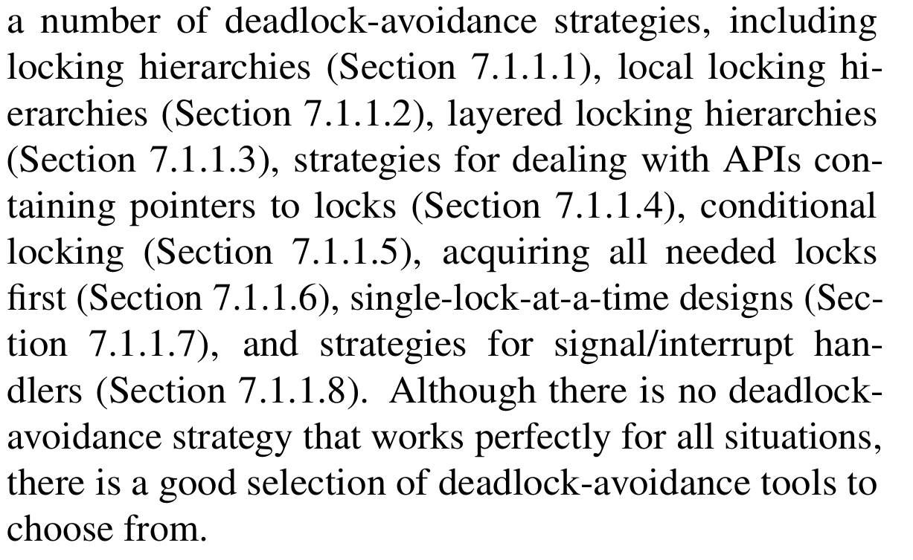

* 몇가지 데드락을 피하기위한 방법을 커널에서 이런것들을 쓴다.

* Locking Hierarchies

* Local Locking Hierarchies

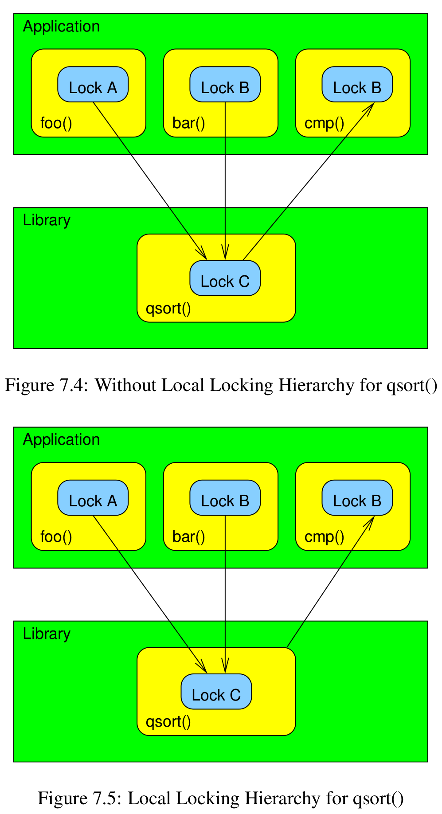

* Layered Locking Hierarchies

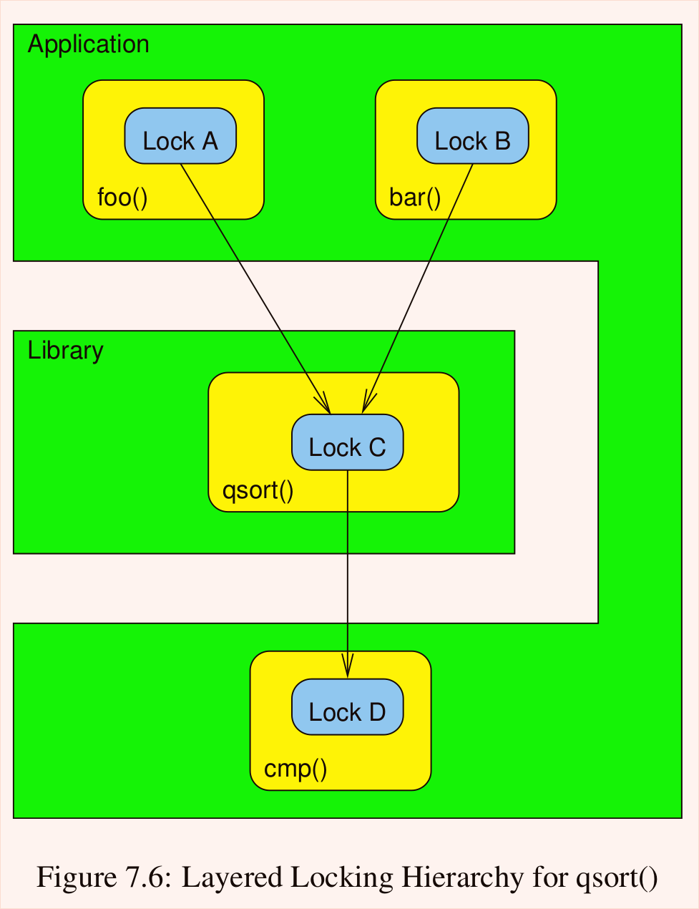

* 경우에 따라서 cmp() 의 어셈 레벨 변환이 필요하긴 하지만 이건 deadlock 을 피하기 위해서 지불하기엔 작은 pay 라고 적혀있음.

* 하지만 계층이 계속생기면 복잡해져서 별로임

* Locking Hierarchies and pointers to locks

> 17.04.2017

### 오늘은 그냥 distributed shared memory 에 대해서 공부함

* 나눠져 있는 메모리를 하나의 메모리공간처럼 사용하는 방법

* 그렇다면 이거의 반대방법은 없을까? 하나의 메모리를 각각 코어로 나누어주는 방법

> 18.04.2017

* 흠....고민이 만쿠만, 어떻게해야지 memory concurrency 를 줄일수 있을까

* 테이블 두개를 가지고 스위칭 해볼까

* 흠.......

### Intel memory model

* Memory segmentation

* 기존 GPRs( Genereal-purpose registers ) 들은 32bit걸로부터 extend 된다.

* eax , ebx, ecx, edx, ebp, esp, esi, edi -> rax, rbx, rcx, rdx, rbp, rsp, rsi, rdi, r8, r9, r10, r11, r12, r13, r14 로 많아짐

* XMM (SSE) registers -> 128비트 레지스터 ( 주로 부동 소수점 연산을 위해서 사용됨 ) 이게 64비트에선 더 늘어났다.

* Large virtual, physical address mode 가 가능하다.

* PAE ( Physical Address Extension ) 모드 

* PIC ( Position Independent code ) 란

* 을 이해하기 위해서는 링커로 가보자

* ELF 파일이란 

* 링커, 컴파일러, 로더 정도에서 사용하고 ELF섹션은 어셈블러나 링커가 ELF 파일을 취급할 때의 단위이다. ELF 파일에선 코드나 데이터를 목적에 따라 섹션으로 분할해서 저장한다. 어셈블러나 링커는 ELF 파일의 섹션 헤더를 참고하여 섹션들을 읽는다.

* ELF 세그먼트는 로더가 ELF 파일을 다룰 때 쓰는 단위이다. 하나의 세그먼트는 여러 개의 섹션으로 이루어 질 수 있다. 로더는 ELF 프로그램 헤더를 보고 로드 작업 수행한다.

* ELF 섹션

~~~~
.text -> 기계어 코드
.data -> 글로벌 변수 등등
.rodata -> readonly 데이터
.bss -> 초기화되지 않은 글로벌 변수
.rel.text -> .text 섹션 중의 심볼 재배치 정보
.symtab -> 이 파일에 포함되는 심볼 표. 실제로는 .strtab 섹션에 저장
.strtab -> 심볼 등의 문자열 테이블
.shstrtab -> 섹션명의 문자열 테이블
.init -> 오브젝트 파일 로드할 때 실행되는 코드
.init_array -> 오브젝트 파일 로드할 때 실행되는 함수의 포인터 배열
.fini -> 프로세스 종료 전에 실행되는 코드
.fini_array -> 프로세스 종료 전에 실행되는 함수의 포인터 배열
.note -> 호환성 확보 등 여러 목적으로 활용
.debug -> 디버그용 심볼 정보
.line -> 코드와 오리지널 소스코드 행 번호와 대응
~~~~

* ELF 메타 데이터

* 링커에서 중요한 것은 심볼, 재배치 정보

* 심볼 -> 함수나 변수를 가리키는 이름

* 재배치 정보 -> 링크가 끝나지 않아서 주소가 아직 확정되지 않은 코드의 위치를 나타내는 정보. 동적 라이브러리 링크인 경우, 런타임 전에는 실제 함수 주소를 알 수 없어 확정될 수 없다.

* .rel.~~ 는 재배치 관련 정보들을 담고있는 섹션이다.

* 그래서 컴파일 타임에 최종적으로는 재배치된다.

* 그러나 동적 라이브러리를 사용하는 경우에는 런타임때가 되어야 실제 주소를 알 수 있기 때문에 가짜 주소를 놔두었다가 진짜 주소로 변환한다.

* 좋았어 그러면 PIC 로 돌아와보자

* PIC가 왜 필요 할까? 

* 다이나믹 링킹시에 static 링크의 재배치처럼 할 경우에 text 섹션을 런타임에 변경해야한다.

* **하지만** memory에 로드된 text 섹션은 write 권한이 없다. 또한 여러 프로세스에서 한가지 .so 를 공유하게 될 경우에 한 프로세스에서 이 내용을 변경해버리면 다른 프로세스 까지 영향을 미친다.

* RW 가능한 영역(data) 에 실제 함수에 대한 포인터 테이블 (got,plt)  에 쓴다. 그리고 text 영역의 재배치 필요한 코드에는 RW 가능한 영역(data) offset 을 알 수 있으므로, 그 테이블을 처음부터 가리키게 써둔다.  ㅇㅋㅇㅋ 굿

* 그렇다면 PIE ( Position Independent Executable ) 이란?

* 모든 심볼을 상대주소로 작성하는것

출처 : [post](blog.daum.net/tlos6733/124)

* 다시 돌아와서

* 시간 날때 읽어보자 [x64 architecture deep dive](kuaaan.tistory.com/403)

* RIP 레지스터는 현재 수행중인 명령의 address를 가리키는 레지스터임

* RIP 레지스터 값과 32비트 operand 를 통해서 64비트 주소공간을 나타낼 수 있음.

> 24.04.2017

## 연구실 서버 접속

~~~~

1. ~~~ 접속
2. 로그인
이전에 remote
3. remote control -> start remote control

~~~~

## PARSEC3.0 compile error

* core 버전 다운로드 받음 [link](http://parsec.cs.princeton.edu/parsec3-doc.htm)

* 압축풀고

* 필요한 패키지 설치

* [link](https://gumdaeng.com/2014/06/26/parsec-3-0-installation-solution-for-build-error/) [link2](https://yulistic.gitlab.io/2016/05/parsec-3.0-installation-issues/) 참조

~~~~

sudo apt-get install make gcc g++ m4 libxi-dev libxmu-dev libxt-dev libxext-dev libx11-dev libtbb-dev pkg-config gettext

sudo apt-get install libxi-dev libxmu-dev libxt-dev libxext-dev libx11-dev

sudo apt-get install -y build-essential m4 x11proto-xext-dev libglu1-mesa-dev libxi-dev libxmu-dev libtbb-dev

source env.sh

[./modify_pod_file.sh](../personal_project/parsec_modify/modify_pod_file.sh)

/pkgs/libs/uptcpip/src/include/sys/bsd__types/h line 96~106 까지 주석처리

parsecmgmt -a build -p all

parsecmgmt -a run -p all
~~~~

* [compile issue](https://yulistic.gitlab.io/2016/05/parsec-3.0-installation-issues/)

<<<<<<< HEAD
> 04.05.2017

### 몇개가 날아간것 같네;;

* 어쨋든 그동안 코딩하고 과제하고 하느라 개인공부 제대루 못함

* 우분투를 mac 스타일로 바꾸는중 [macbuntu](https://www.youtube.com/watch?v=eVzYtlR_OH0)

* 우분투에 pc 카카오톡 깔았음

### 웹 정보 프로그래밍 과제를 위해 데이터를 찾아보자

* 미세먼지 예측 프로그램 만들꺼임

* 자연적 원인 : 토양, 화산 , 꽃가루 , 산불 등등..

* 인공적인 원인 : 난방, 발전(화학연료) , 자동차 등등..

* 배출의 원인에 따라서 1차 미세먼지와 2차 미세먼지가 있음

* 1차 미세먼지 : 자동차, 발전소, 공장

* 2차 미세먼지 1차 미세먼지 중에서 질산화물과 황산화물이 화학반응을 일으켜 새로이 생성되는 물질

* 2차 미세먼지는 1차에 비해서 양을 예측하기가 어렵다. 그러나 대기오염의 상당부분을 차지하고 있당

* aqicn 이라는 사이트에서 [API](http://aqicn.org/api/kr/) 제공 일단 오늘은 여기까지

### Manycore 로 돌아와서

## 운영모드와 레지스터

* 64비트 레지스턴데 운영 모드에 따라서 일부영역만 사용될 수도있음

* 대체로 64비트 레지스터는 R접두사가 붙고 ,32 비트 레지스터에는 E 접두사나 D 접미사가 붙음

* 64비트 OS 갖추어야 할 필수 운영 모드 ( 리얼모드 , 보호모드 , IA-32e 모드 )

## 세그먼트 레지스터

[출처](http://m.blog.naver.com/rockcrash/220685116797)

## 메모리 관리 기법

* x86-64 에서 지원하는 메모리 관리 기법은 크게 세그멘테이션과 페이징 두가지로 나뉜다.

* 페이징은 컨트롤 레지스터 중에 CR3 레지스터에 페이지 디렉토리의 물리주소를 설정해줌

* 갑자기 논문 써야되서 이쯤 종료

=======
> 25.04.2017
>>>>>>> f67c5675b50d856d46ff81a0b740988d98c1a0dd

### 시험끗~

## userid 만들기

~~~~

useradd name -m -s /bin/bash

userdel -r name

~~~~
## PARSEC 확인

* full version 받아서 빌드~

## running script 만들기

* date 사용법 확인

* running script 만들었음

* graph 그리는거 만들었음

* 뭔가 부하가 걸리는 구간이 있는듯

> 26.04.2017

* 설문조사 해서 냈음

* parsec roi 적용 ( gcc-hooks ) 해서 컴파일중 결과 봐야함

* tmpfs 봐야함

### texlive 설치

~~~~

sudo add-apt-repository ppa:jonathonf/texlive

sudo apt update

sudo apt install texlive-full

~~~~

* bamos 꺼 parsec 에 parsecmgmt 900 번째 줄에 문제가 있음, 지우고 했더니 빌드중

* 실행됨 매크로에 시간찍는거 추가해보자

* gcc-hook 적용된 걸로 example 돌려봄

* parsecmgmt -a run -p all -c gcc-hooks -i native -k -n 90 >> run_all_sample.txt

> 02.05.2017

### GANs 로 만들꺼 데이터좀 찾아보쟝

> 04.05.2017

### 몇개가 날아간것 같네;;

* 어쨋든 그동안 코딩하고 과제하고 하느라 개인공부 제대루 못함

* 우분투를 mac 스타일로 바꾸는중 [macbuntu](https://www.youtube.com/watch?v=eVzYtlR_OH0)

* 우분투에 pc 카카오톡 깔았음

### 웹 정보 프로그래밍 과제를 위해 데이터를 찾아보자

* 미세먼지 예측 프로그램 만들꺼임

* 자연적 원인 : 토양, 화산 , 꽃가루 , 산불 등등..

* 인공적인 원인 : 난방, 발전(화학연료) , 자동차 등등..

* 배출의 원인에 따라서 1차 미세먼지와 2차 미세먼지가 있음

* 1차 미세먼지 : 자동차, 발전소, 공장

* 2차 미세먼지 1차 미세먼지 중에서 질산화물과 황산화물이 화학반응을 일으켜 새로이 생성되는 물질

* 2차 미세먼지는 1차에 비해서 양을 예측하기가 어렵다. 그러나 대기오염의 상당부분을 차지하고 있당

* aqicn 이라는 사이트에서 [API](http://aqicn.org/api/kr/) 제공 일단 오늘은 여기까지

### Manycore 로 돌아와서

## 운영모드와 레지스터

* 64비트 레지스턴데 운영 모드에 따라서 일부영역만 사용될 수도있음

* 대체로 64비트 레지스터는 R접두사가 붙고 ,32 비트 레지스터에는 E 접두사나 D 접미사가 붙음

* 64비트 OS 갖추어야 할 필수 운영 모드 ( 리얼모드 , 보호모드 , IA-32e 모드 )

## 세그먼트 레지스터

[출처](http://m.blog.naver.com/rockcrash/220685116797)

## 메모리 관리 기법

* x86-64 에서 지원하는 메모리 관리 기법은 크게 세그멘테이션과 페이징 두가지로 나뉜다.

* 페이징은 컨트롤 레지스터 중에 CR3 레지스터에 페이지 디렉토리의 물리주소를 설정해줌

* 갑자기 논문 써야되서 이쯤 종료

> 08.05.2017

* 일단 kcc 클리어

* 컴프 과제를 올려야한다.

* 올렸음

### 웹 정보처리 과제

* 논문 3개 골랐음

> 09.05.2017

### 과제 시작

* abstract 다적었음 

* 이따가 업로드 하장

* 잠시 시간이 비어서 내 논문관련해서 좀 찾아보기루함

### Scalability-based manycore partitioning

* [link](http://dl.acm.org/citation.cfm?id=2370833)

## Abstract

* 멀티코어에서 매니코어로 바뀌어가고있다

* 단일 시스템에서 여러 멀티스레드 프로그램이 실행되는 일이 잦아지고있음

* 일반적으로 각 스레드는 기본 논리코어수와 비교해서 코어만큼 실행하거나 코어보다 많은 수의 스레드를 만들어냄

* 하지만 각 프로그램은 서로 다른 확장성을 가지고 있을 뿐더러 공유 리소스에 대한 경쟁이 심해지게됨

* 따라서 OS 스레드 스케쥴링이 높은 시스템 성능을 만족하는데 중요한 역활을 수행하는 것이 분명함

* 해당 논문에서는 하드웨어 성능 모니터링 장치를 이용해서 프로그램의 확장성을 동적으로 예측하고

* 각 프로그램에 할당할 최적 코어수를 결정하며

* 프로그램에 코어를 할당하는 스케쥴러를 개발하였다.

* 리눅스 스케쥴러보다 개선된 효과를 보이는걸 보여준다.

* 꼭 읽어볼것

### Processes and Resource Management in a Scalable Many-core OS

* [link](https://www.usenix.org/legacy/event/hotpar10/tech/full_papers/Klues.pdf)

## Abstract

* ROS 라고 하는 새로운 운영체제를 제안함

* 이 os 의 목표는 병렬 프로그램을 위한 더 나은 지원을 제공하는 것

* 수천개의 코어로 커널을 확장하는 것

* 프로세스 모델과 리소스 관리 알고리즘에 중점을 둔 논문임

* Space-time partitioning 을 이용해서 했음 관련 연구가 있는듯 

* 보호 도메인은 리소스 매니징과 결합되어서는 안되며 자원 분할이 반드시 자원 할당과 겹치지 않아야합니다.

* 꼭 읽어볼것

### Threaded Dynamic Memory Management in Many-Core Processors

* [link](http://ieeexplore.ieee.org/abstract/document/5447394/)

## Abstract

* 이것도 똑같이 시작함

* 기존 소스나 calloc malloc free 등을 고칠 필요가없다

* 2~4% 정도의 성능향상을 이루었음 SPEC CPU2006 벤치마크 기준

### Multi-threaded memory management 

* [link](https://www.google.com/patents/US9135183)

## Abstract

* 꼭 다운받아서 읽어보자

> 10.05.2017

# SIMD

* 병렬 프로세서의 한 종류, 하나의 명령어로 여러 개의 값을 동시에 계산하는 방식

* XMalloc 의 방식에 대해서 알아보려했는데 먼저 SIMD 에 대해서 쫌 알아야할듯

> 16.05.2017

### A Scalable Ordering Primitive with Invariant Hardware Clocks

## 참고

* RDTSC(Read Time Stamp Counter)

* fail-stop model

## ORDO : A Scalable Ordering Primitive

* 두개의 lemma를 주장했음

* use case 를 여러개 만들었음

# Oplog

> 17.05.2017

### PARSEC scalability 문제점 분석

## [PARSECSs](./papers/PARSECSs.pdf)

* OmpSs 라는걸 사용하는데 이걸 사용해서 기존 Pthreads | OpenMP 보다 성능이 잘나옴

## OmpSs

* 갑자기 궁금해져서 좀 살펴봄

* 카탈루냐 대학교 박사 논문

* superscalar cpu 에서 영향을 받았음

* 프로그램을 이것처럼 커널에서 나눠서 인식할 수 있다면?

* 런타임 인식이 필요함

> 22.05.2017

* 옵티마이저는 어떨까???

> 23.05.2017

* 느슨한 메모리 동시성 모델에 대해서 읽어보기로함, 읽고 정리할듯

> 12.06.2017

* 커밋이 너무 여기저기 있어서 그냥 다 버리고 새로 시작

* benchmark set 을 만들장

* PARSEC 을 먼저 살펴보는중

> 13.06.2017

## Tiny Directory

* 내 주제랑 맞지않음

## transactional memory

* 불러오기와 저장하기 명령의 집합이 원자적 방법으로 실행할 수 있게 함으로써 병행성 프로그래밍을 단순하게 하는 방식.

### StAdHyTM

* transactional memory 에 대해서 좀더 알아보쟝

> 14.06.2017

### 매니코어 시스템에 대한 서베이 논문

> 16.06.2017

### NR 알고리즘
